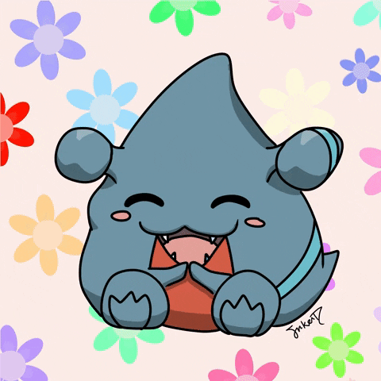
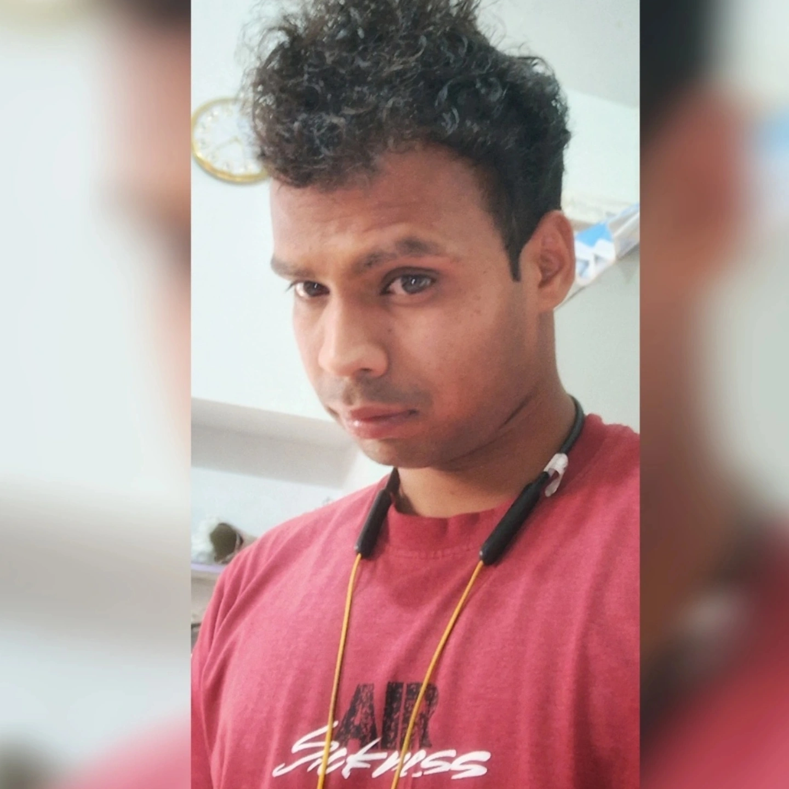

<h1> Hi there, I'm Chandrashekhar Kachawa  </h1>

  

# About ME 💬 :

  

### - I'm 24 years old Full Stack Developer from India.

  <h3>- Learning :</h3>
  <ul>
    <li>✨ Golang Backend with Postgres right now...</li>
    <li>✨ Unit Testing</li>
  </ul>

  <h3>- Hobbies :</h3>
  <ul>
    <li>✨ Singing (Spanish)</li>
    <li>✨ Watching Anime</li>
    <li>✨ Workout</li>
    <li>✨ Travelling</li>
  </ul>

 
 
 
 

# Languages & Tools 👨‍💻 🛠:

 

 
 
 

# Contact Me :

 

 
 
 

---
